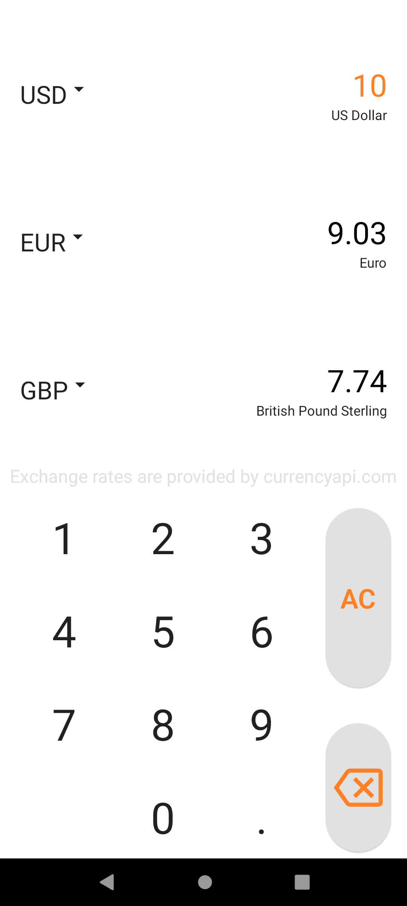
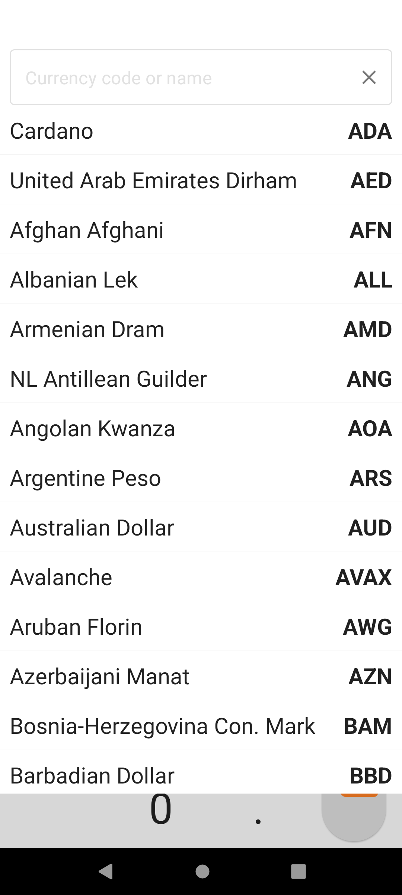
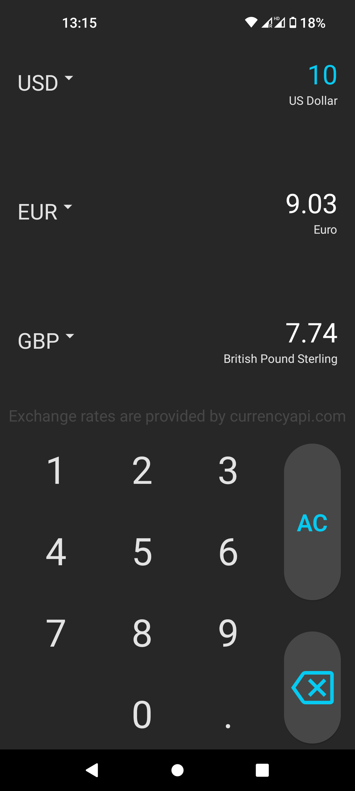
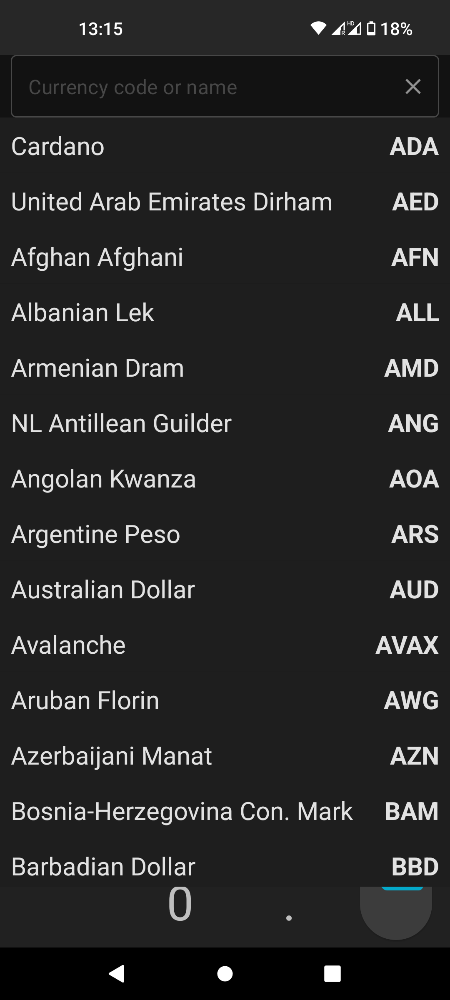

# SimpleCurrencyCalculator

This is simplest currency converter calculator you can image. You just choose three currencies from up to 177, including most popular crypto currencies. All of that is provided by [currency-api](https://currencyapi.com/).

## Technologies

- Android
- Kotlin
- Jetpack Compose
- Javascript (firebase functions)
- Firebase firestore
- Firebase functions 
- okHttp
- gson

## About

It is a little bit improved copy of currency calculator i was having on my old xiaomi phone. It was created because I really liked format of this old app.

## Features 

- Possibility of calculating two currencies on every input change
- Search field with all those 177 currencies, to make things better there is aviable search bar
- Currencies data is updated every 24 hours from [currency-api](https://currencyapi.com/) thanks to firebase functions
- All that data is saved on firebase firestore and user is getting it on launch
- State of inputs are saved on user divice using [ROOM](https://developer.android.com/training/data-storage/room)
- Nice and minimalistic look both on light mode and dark mode

## Screenshoots

